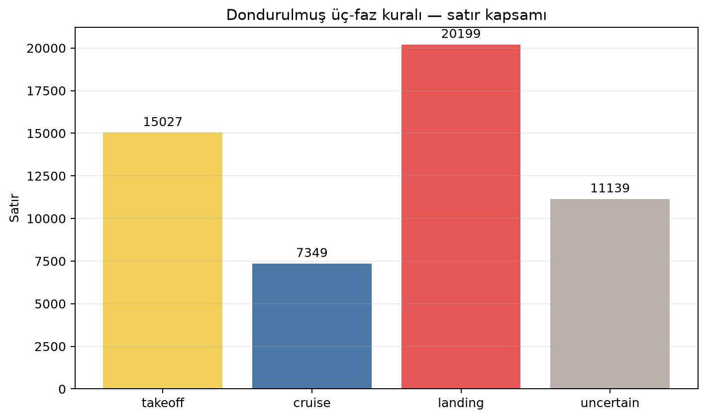
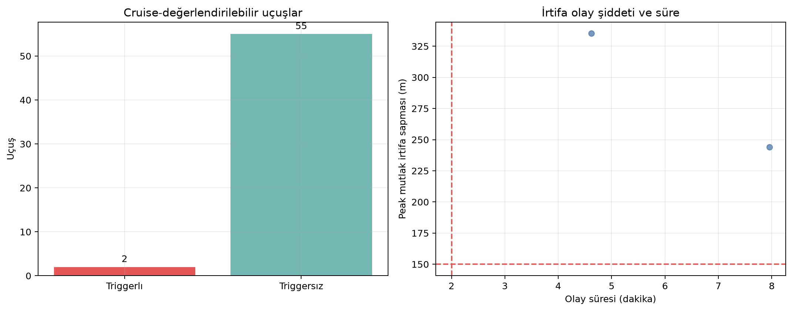
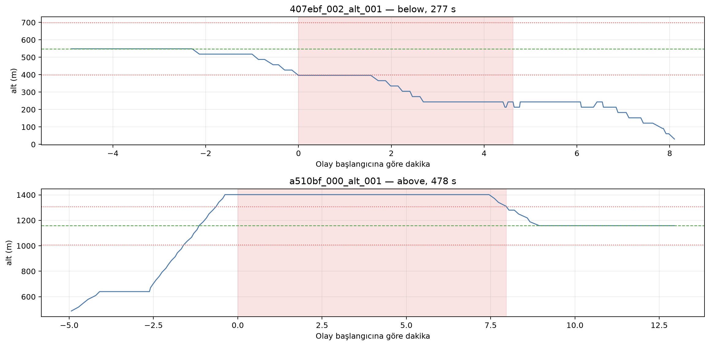

# ADS-B Basit Anomali — İrtifa Keşif Raporu

> Dondurulmuş kural: cruise medyanından `±150 m`, `>120 s`.
> Operasyonel başarı/recall iddiası yoktur.

- Silver: `data/objectstore/silver/adsblol_historical/part-20260710T125240580717Z-fcdf1dca.parquet`
- Silver SHA-256: `2769ba79cb2611ed2b7d39ecae8c7fe1db6975b771e4195d530dbf2a071aa5e1`
- Ön-kayıt SHA-256: `dbdea3c469b623b5876203f886b1e8f6e81da6264f5682bbe82d2951752207cb`
- Sabit örnek: 100 uçuş / 53,714 satır
- Üç-faz çözülen: 57/100 uçuş
- Ground truth yok; bu bir keşif/karakterizasyon raporudur.

## Sonuç

- Cruise-değerlendirilebilir uçuş: 57
- En az bir olaylı uçuş: 2 (3.51%)
- Olay sayısı: 2
- Data-quality-suspect olay: 0
- Süre dağılımı (s): `{'p25': 327.4524998664856, 'p50': 377.50499987602234, 'p75': 427.5574998855591, 'p95': 467.59949989318847}`
- Peak sapma dağılımı (m): `{'p25': 266.7249999999999, 'p50': 289.54999999999995, 'p75': 312.375, 'p95': 330.63500000000005}`
- Nitel incelemede doğrulanmış anomaly: 0

## Stable-hash nitel inceleme örneği

| event_id | duration_s | direction | peak_abs_deviation_m | data_quality_suspect |
|---|---|---|---|---|
| 407ebf_002_alt_001 | 277.40 | below | 335.20 | False |
| a510bf_000_alt_001 | 477.61 | above | 243.90 | False |

- `407ebf_002_alt_001`: cruise etiketi içindeki geç iniş/descent bölümü; faz
  sınırı false-positive adayı.
- `a510bf_000_alt_001`: yaklaşık 1402 m ve 1158 m'de iki stabil seviye; tüm-cruise
  medyanı ilk seviyeyi sapma sayıyor. Meşru seviye değişimiyle uyumlu.
- İki olayda da barometrik/geometrik kaynak uyuşmazlığı bayrağı yok. Bu nedenle
  ikisi de doğrulanmış anomaly değildir.

## Sınır

Kural yalnız üç fazı tam çözülen trace'lerin cruise bölümünü değerlendirir.
`uncertain` uçuşlar normal sayılmamış, kapsam dışı bırakılmıştır. Trigger bir
fiziksel olay adayıdır; doğrulanmış anomaly etiketi değildir.
