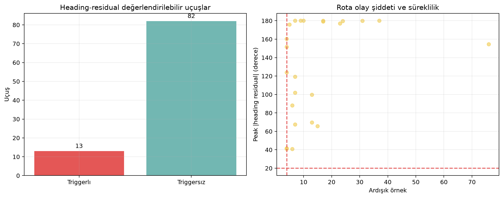
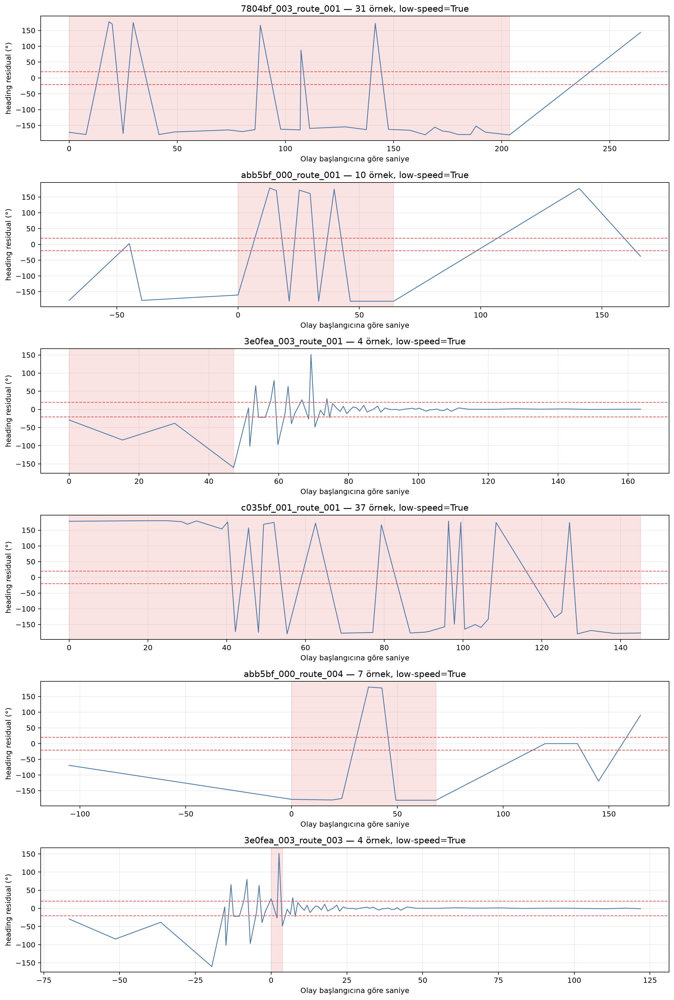

# ADS-B Basit Anomali — GPS/Rota Keşif Raporu

> Dondurulmuş kural: `|heading_residual| >=20°`, en az 4 ardışık örnek.
> Operasyonel başarı/recall iddiası yoktur.

- Silver: `data/objectstore/silver/adsblol_historical/part-20260710T125240580717Z-fcdf1dca.parquet`
- Silver SHA-256: `2769ba79cb2611ed2b7d39ecae8c7fe1db6975b771e4195d530dbf2a071aa5e1`
- Ön-kayıt SHA-256: `dbdea3c469b623b5876203f886b1e8f6e81da6264f5682bbe82d2951752207cb`
- Sabit örnek: 100 uçuş / 53,714 satır
- Üç-faz çözülen: 57/100 uçuş
- Ground truth yok; bu bir keşif/karakterizasyon raporudur.

## Sonuç

- Heading-residual değerlendirilebilir uçuş: 95
- En az bir olaylı uçuş: 13 (13.68%)
- Olay sayısı: 24
- Düşük-hız bağlamlı olay: 24
- Tamamı düşük-hız satırlarından oluşan olay: 23
- Cruise fazındaki olay: 0
- Ardışık örnek dağılımı: `{'p25': 5.75, 'p50': 8.0, 'p75': 17.0, 'p95': 36.09999999999999}`
- Peak heading-residual dağılımı (derece): `{'p25': 83.42024432697377, 'p50': 152.98330176908942, 'p75': 179.63809936132992, 'p95': 180.0}`
- Olay faz dağılımı: `{'takeoff': 17, 'landing': 5, 'uncertain': 2}`

## Stable-hash nitel inceleme örneği

| event_id | n_samples | duration_s | phase | peak_abs_heading_residual_deg | low_speed_context |
|---|---|---|---|---|---|
| 7804bf_003_route_001 | 31 | 203.63 | uncertain | 179.83 | True |
| abb5bf_000_route_001 | 10 | 64.11 | takeoff | 180.00 | True |
| 3e0fea_003_route_001 | 4 | 47.09 | takeoff | 160.27 | True |
| c035bf_001_route_001 | 37 | 145.04 | takeoff | 180.00 | True |
| abb5bf_000_route_004 | 7 | 68.27 | takeoff | 180.00 | True |
| 3e0fea_003_route_003 | 4 | 3.72 | takeoff | 151.51 | True |

## Sınır

Kural bildirilen track ile iki konumdan türetilen bearing arasındaki iç
tutarsızlığı bulur; planlanan rotadan sapmayı doğrudan ölçmez. Düşük hız olayları
silinmemiş, bearing kararsızlığı bağlamı olarak ayrıca işaretlenmiştir. Trigger
doğrulanmış spoofing/anomaly etiketi değildir.

24 olayın 23 tanesinde bütün
örnekler `<30 m/s`; en düşük olay-içi düşük-hız oranı
`69.23%`dir. Cruise olayı
`0`. Bu turdaki rota triggerları
GPS/rota anomaly kanıtından çok düşük-hız konum/bearing kararsızlığıdır.
