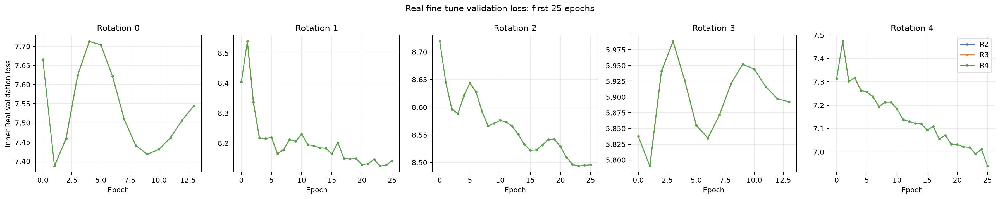
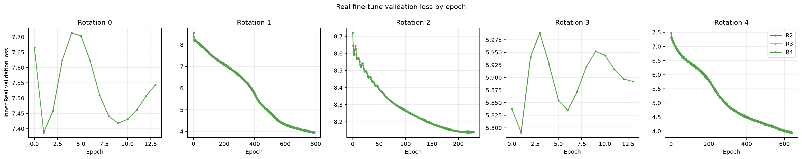
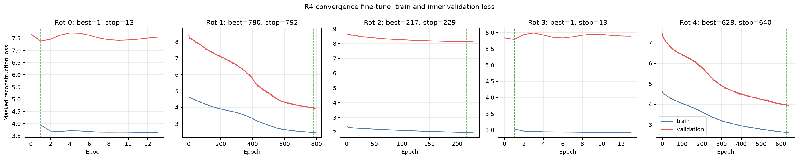
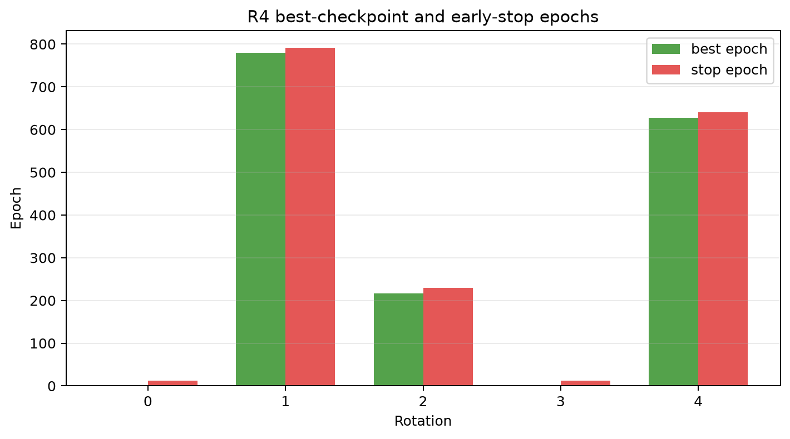
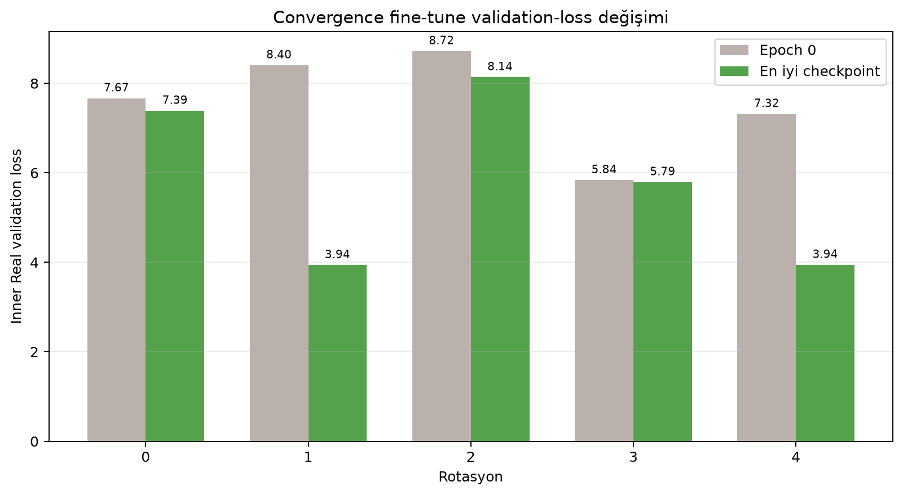
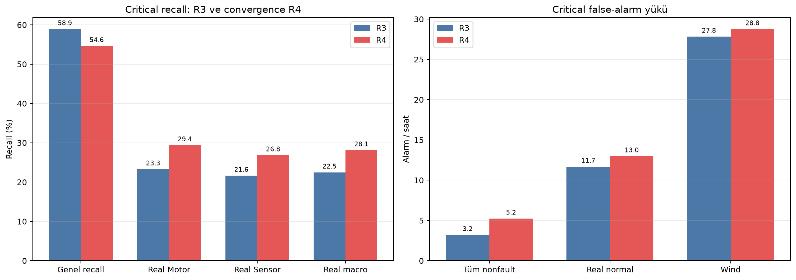
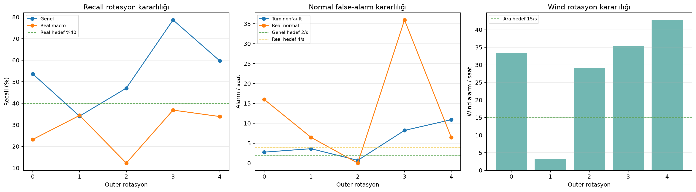
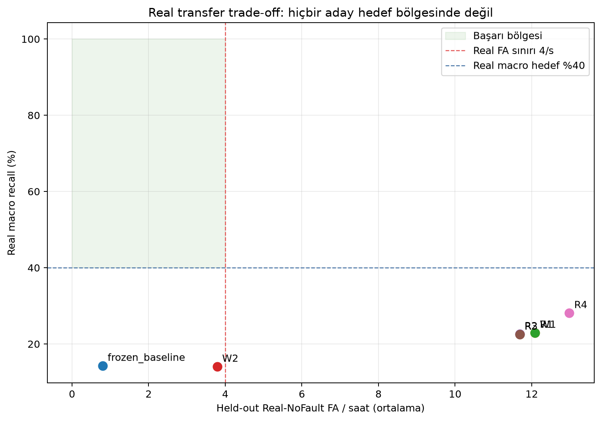
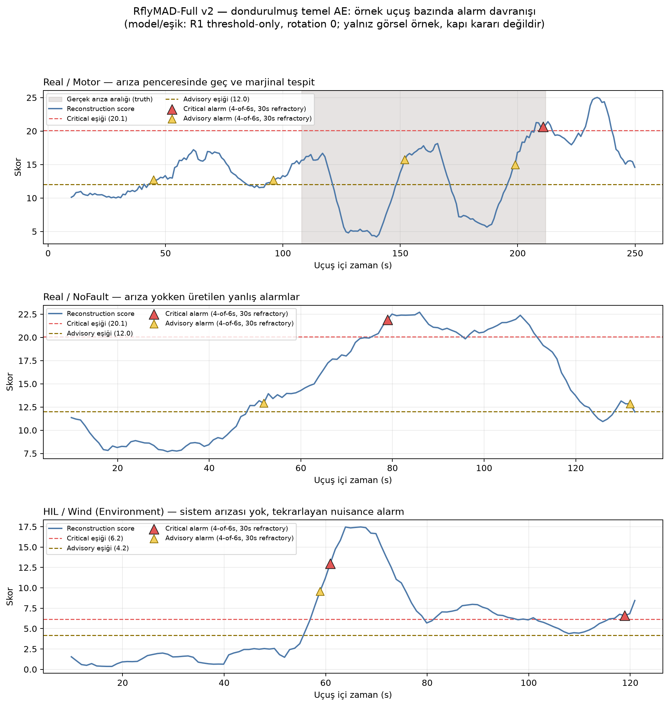

# RflyMAD-Full v2 — Real Fine-Tune Convergence Deney Raporu

> Deney: R4 — Real-NoFault convergence fine-tune  
> Tarih: 2026-07-22 (Europe/Istanbul)  
> Durum: `development_only_convergence_followup`  
> Locked test: okunmadı  
> Operasyonel/fizibilite iddiası: yok

## 1. Yönetici özeti

Sekiz epoch bütün rotasyonlar için yeterli değildir. Beş rotasyondaki en iyi/durma
epoch'ları `1/13`, `780/792`, `217/229`, `1/13`, `628/640` oldu. İki rotasyon
epoch 1'den sonra overfit olmaya başlarken üç rotasyon yüzlerce epoch boyunca
iyileşti. Bu nedenle sabit epoch yerine inner-validation early stopping gereklidir.

Convergence fine-tune, R3'e göre critical Real macro recall'ı `%22,46`dan
`%28,11`e yükseltti. Ancak aynı anda:

- genel recall `%58,90 → %54,61` düştü;
- tüm nonfault FA `3,20 → 5,24/saat` yükseldi;
- Real-NoFault FA `11,68 → 12,98/saat` yükseldi;
- en düşük rotasyon Real macro recall yalnız `%12,24` oldu;
- Real macro bootstrap %95 güven aralığı `%24,92–%31,44`te kaldı.

Sonuç: uzun eğitim bazı Real fault sinyallerini güçlendiriyor, fakat alarm yükü ve
domain genellemesi bozuluyor. R4, dondurulmuş `%40` Real macro ve FA kapılarını
geçmedi. Sorun yalnız epoch azlığı değildir.

## 2. Deney sözleşmesi

Deney, kullanıcı sekiz epoch'un az olabileceğini belirttikten sonra sonuç koşusundan
önce ayrı ek sözleşmeyle donduruldu:
`RFLYMAD_V2_CONVERGENCE_EK_SOZLESME_20260722.md`.

- Her rotasyon kendi nested base AE checkpoint'inden başladı.
- Fine-tune yalnız train Real-NoFault uçuşlarını kullandı.
- Checkpoint seçimi yalnız inner Real-NoFault reconstruction validation loss ile
  yapıldı; outer metrikler epoch seçimine girmedi.
- Epoch 0, değiştirilmemiş base checkpoint olarak yarışta tutuldu.
- `lr=1e-4`, AdamW weight decay `1e-4`, batch size `128`.
- Early stopping: `patience=12`, `min_delta=1e-4`.
- İlk 100-epoch tavanına dayanan rotasyonlar 500'e; hâlâ sınırda olanlar 2000'e
  uzatıldı. Uzatma kararı yalnız inner loss eğrisine dayandı.
- Fault uçuşları scaler, fine-tune, early stopping veya threshold seçiminde yoktu.
- Locked-test feature dosyaları okunmadı.

Cap uzatmalarında ilk 100/500 epoch deterministik olarak tekrarlandı. Validation
replay maksimum mutlak farkı `0–8,9e-16` aralığındadır.

## 3. Epoch davranışı

### 3.1 İlk 25 epoch: kısa koşular neden yanıltıcı?

Rotasyon 0 ve 3'te en iyi checkpoint epoch 1'dir. Rotasyon 1, 2 ve 4'te ise sekiz
epoch yalnız eğrinin başlangıcıdır. Dolayısıyla “8 epoch sonucu” bazı session
splitlerinde undertraining, bazılarında overtraining içeriyordu.

### 3.2 Tam convergence eğrileri

| Rotasyon | Epoch-0 val | En iyi val | En iyi epoch | Durma epoch | Stop reason |
|---:|---:|---:|---:|---:|---|
| 0 | 7,6656 | 7,3868 | 1 | 13 | patience exhausted |
| 1 | 8,4032 | 3,9386 | 780 | 792 | patience exhausted |
| 2 | 8,7191 | 8,1356 | 217 | 229 | patience exhausted |
| 3 | 5,8375 | 5,7902 | 1 | 13 | patience exhausted |
| 4 | 7,3151 | 3,9436 | 628 | 640 | patience exhausted |

Validation-loss kazanımı session'a çok bağımlıdır. Rotasyon 1 ve 4 büyük düşüş
gösterirken rotasyon 0 ve 3 neredeyse anında plato/overfit göstermektedir. Bu,
yalnız üç Real-NoFault session grubuyla çalışmanın yapısal oynaklığını gösterir.

## 4. Anomaly-detection sonuçları

### 4.1 R3 ve convergence R4 karşılaştırması

| Politika | Aday | Genel recall | Nonfault FA/s | Wind FA/s | Real Motor | Real Sensor | Real macro | Real FA/s |
|---|---|---:|---:|---:|---:|---:|---:|---:|
| Critical | R3, 8 epoch | %58,90 | 3,20 | 27,83 | %23,27 | %21,65 | %22,46 | 11,68 |
| Critical | R4, convergence | %54,61 | 5,24 | 28,75 | %29,39 | %26,84 | %28,11 | 12,98 |
| Advisory | R3, 8 epoch | %64,59 | 8,56 | 32,81 | %28,06 | %28,48 | %28,27 | 22,87 |
| Advisory | R4, convergence | %64,18 | 8,75 | 33,41 | %34,39 | %34,94 | %34,66 | 26,76 |

R4 hem critical hem advisory Real recall'ı artırdı. Fakat critical genel recall
4,29 yüzde puan düştü ve FA yükü arttı. Reconstruction loss'un converge olması,
fault/no-fault ayrımının veya alarm politikasının converge olduğu anlamına gelmez.

### 4.2 Rotasyon kararlılığı

R4 critical sonuç aralıkları:

- genel recall: `%34,04–%78,68`;
- Real macro recall: `%12,24–%36,84`;
- tüm nonfault FA: `0,69–10,91/saat`;
- Real-NoFault FA: `0–35,96/saat`;
- Wind FA: `3,20–42,68/saat`.

Bu geniş aralıklar tek bir ortalamanın güvenilir model davranışı gibi sunulamayacağını
gösterir. Özellikle rotasyon 2'de Real-Sensor recall sıfırdır.

### 4.3 Real recall–false-alarm trade-off

Başarı bölgesi Real macro recall `>=%40` ve Real-NoFault FA `<=4/saat`tir. Hiçbir
aday bu bölgeye girmemiştir. R4 recall yönünde ilerlerken yanlış-alarm yönünde
gerilemiştir; bu yüzden araştırma-promosyon kapısını geçmez.

### 4.4 Örnek uçuş bazında alarm davranışı (zaman serisi)

Yukarıdaki tablo aggregate metrik verir; alarm politikasının (4-of-6 saniye,
30 saniye refractory) tek tek uçuşlarda nasıl davrandığını göstermek için üç
örnek uçuş, dondurulmuş temel AE'nin (fine-tune öncesi) skoru ve R1'in aynı
model/scaler üzerinde seçtiği threshold-only eşikleriyle çizilmiştir. Bu görsel
yalnız niteliksel bir örnektir; kapı kararına girmez.

- **Real/Motor:** gerçek arıza aralığı (gri bant) boyunca skor iki kez eşiğin
  epey altına düşüyor; critical alarm arıza bitişine saniyeler kala, marjinal
  biçimde tetikleniyor. Advisory ise arıza başlamadan önce iki kez zaten
  tetiklenmiş durumda — erken/yanlış advisory alarmları arıza içi tespitle
  aynı uçuşta bir arada.
- **Real/NoFault:** arıza hiç yokken skor tek başına critical eşiğini aşıp bir
  alarm üretiyor; bu tam olarak Real-NoFault FA/saat rakamının kaynağıdır.
- **HIL/Wind:** sistem arızası olmadığı halde rüzgar sırasında skor hem
  critical hem advisory eşiğini aşıyor ve tekrar tekrar alarm üretiyor — Wind
  FA yükünün somut görünümü budur.

## 5. Kapı kararı

R4 aşağıdaki Real research-gate koşullarında başarısızdır:

- Real macro ortalama `%28,11 < %40`;
- Real Motor `%29,39 < %30`;
- Real Sensor `%26,84 < %30`;
- rotasyon-minimum Real macro `%12,24 < %25`;
- Real FA ortalama `12,98 > 4/saat`, maksimum `35,96 > 8/saat`;
- genel recall ortalama `%54,61`, frozen koruma sınırının biraz altında;
- minimum genel recall `%34,04 < %50`;
- tüm nonfault FA `5,24 > 2/saat`.

Nihai karar: `real_research_gate_passed=false` ve
`operational_claim_allowed=false`.

## 6. Teknik yorum

Uzun fine-tune'ın davranışı, küçük Real normal setine session-özgü uyum ve diğer
domainlerde unutma/dağılım kaymasıyla uyumludur. Bu bir nedensellik kanıtı değildir,
fakat aşağıdaki gözlemler aynı yöndedir:

1. En iyi epoch session splitine göre `1–780` arasında değişiyor.
2. Inner Real reconstruction loss belirgin azalırken genel fault recall düşüyor.
3. Real recall artışına Real-NoFault FA artışı eşlik ediyor.
4. Beş outer rotasyonda metrik varyansı çok yüksek.

Bu nedenle yeni epoch, LR veya threshold taraması önerilmez. Sonraki araştırma
konusu representation/domain-shift olmalıdır: flight-phase normalization,
domain-invariant feature analizi, encoder katmanlarını kısmen dondurma ve daha fazla
bağımsız Real-NoFault session. Bunlar yeni ve ayrı bir sözleşme gerektirir.

## 7. Tekrarlanabilirlik ve artefaktlar

Deney kökü:
`artifacts/rfly_full/v2/normal_temporal_ae/robustness/approved_20260722_nested_v1/`

- R4 summary: `candidates/R4/summary.json`.
- Kapılar: `candidates/R4/gate_summary.json`.
- Bootstrap: `candidates/R4/bootstrap_ci.json`.
- Ham epoch geçmişleri: `candidates/R4/rotation_*/training_history.csv`.
- Cap snapshotları: ilgili rotasyonlarda `cap_100_snapshot/` ve
  `cap_500_snapshot/`.
- Outer/per-flight metrikler: `candidates/R4/rotation_*/`.
- Görsel üretici (00–07): `scripts/render_rfly_full_v2_convergence_report.py`.
- Görsel üretici (08, örnek-uçuş alarm zaman serisi):
  `scripts/render_rfly_full_v2_alarm_timeseries.py`. Girdi:
  `base/rotation_0/development_scores.parquet` (dondurulmuş temel AE skoru) +
  `candidates/R1/rotation_0/policies.json` (aynı model/scaler üzerinde
  threshold-only eşikler); alarm mantığı `rfly_full.supervised.alarm_onsets`
  içinden birebir import edilir.

Doğrulama sonucu: `44 passed in 2.98s`. Altı adayın her biri 5/5 rotasyon
tamamladı; denetlenen 46 summary'de `locked_test_features_read=false`; çalışan
Python süreci ve `archive/` değişikliği yoktur. Commit/push yapılmadı.
