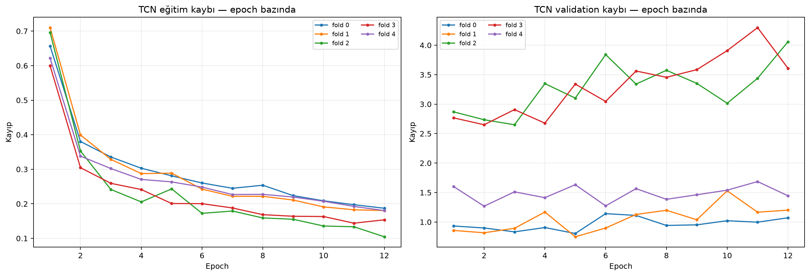
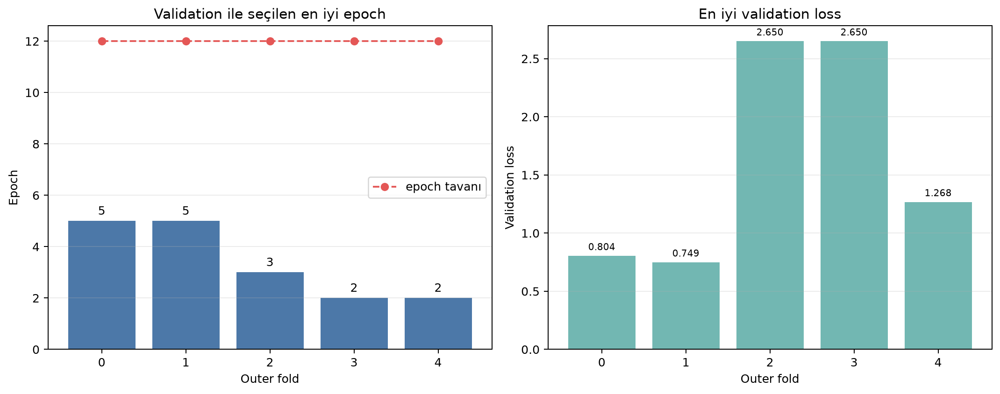
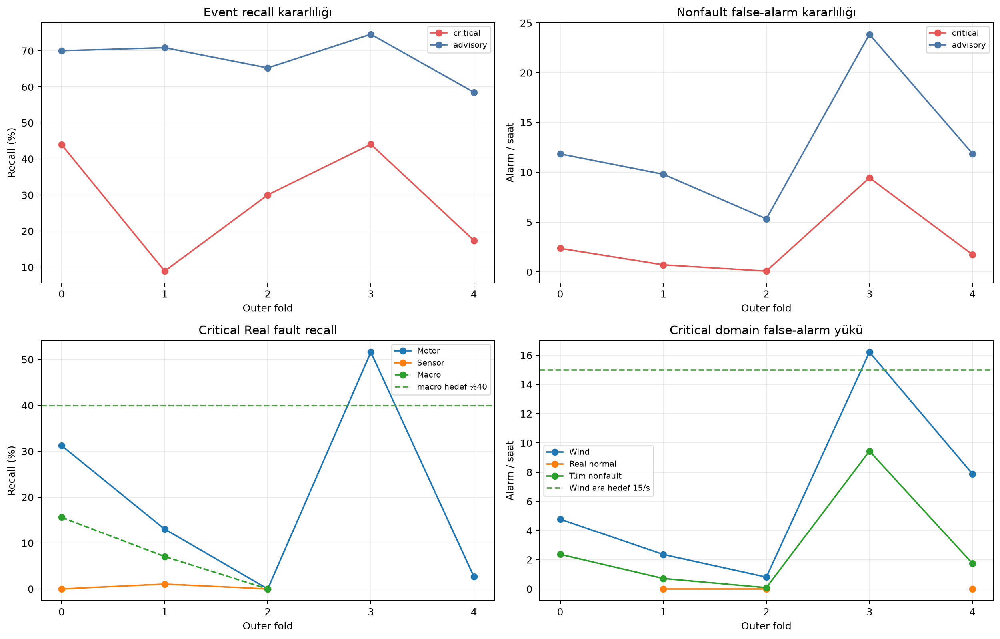
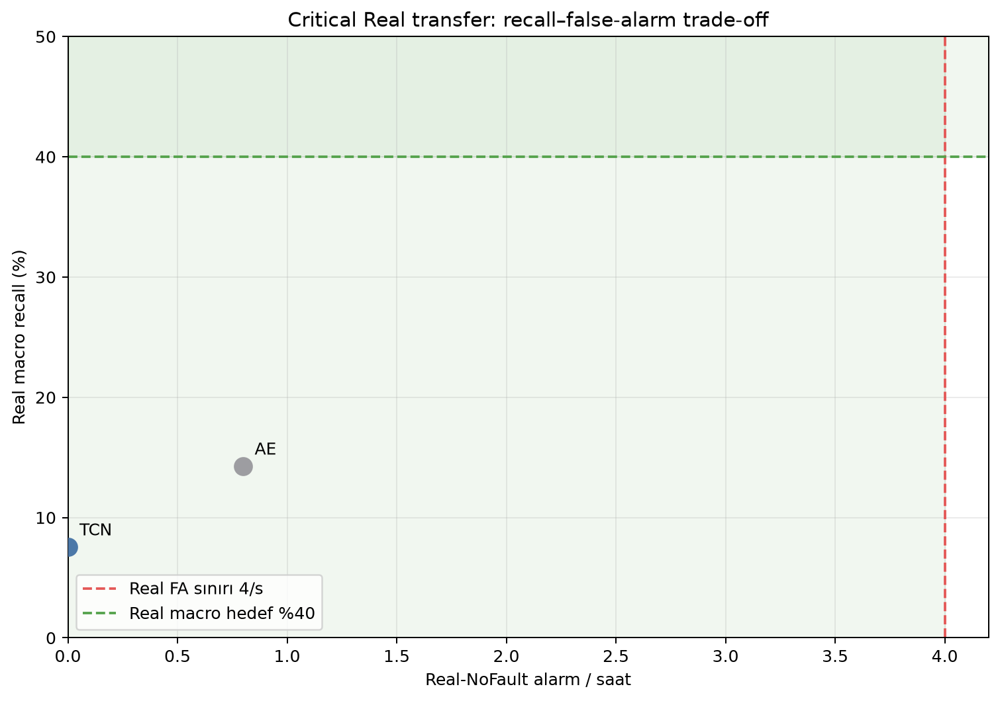
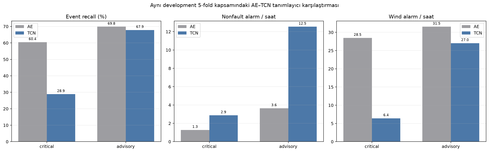

# RflyMAD-Full v2 — TCN Development Deney Raporu

> Tarih: 2026-07-22 (Europe/Istanbul)
> Deney: supervised TCN, development-only 5-fold sweep
> Durum: `development_only_complete`
> Locked test: okunmadı
> Operasyonel/fizibilite iddiası: yok

## 1. Yönetici özeti

Beş development outer fold'un tamamı sonuçlardan önce dondurulan sözleşmeyle
çalıştırıldı. Her fold 12 epoch tavanında kaldı; validation ile seçilen en iyi
epoch'lar `5, 5, 3, 2, 2` oldu. Hiçbir fold son iki epoch'ta en iyi değerini
göstermediği için `12 → 25 → 50` uzatma kuralı tetiklenmedi.

Sonuç, TCN'in mevcut haliyle epoch azlığından değil erken overfit ve domain/fault
ayrımı sorunundan başarısız olduğunu gösteriyor. Training loss bütün foldlarda
düşmeye devam ederken validation loss en iyi epoch'tan sonra yükseldi.

- Critical development kapısı geçmedi: recall `%28,87`, FA `2,87/saat`.
- Advisory development kapısı geçmedi: recall `%67,86`, FA `12,54/saat`.
- Real research kapısı geçmedi: critical Real macro recall yalnız `%7,56`.
- Wind ara kapısı geçmedi: Wind FA `6,41/saat` hedef içinde olsa da critical
  recall ve tüm-nonfault FA koşulları başarısız.
- TCN, frozen AE'ye göre Wind FA'yı düşürdü; bunu critical recall'da çok büyük
  kayıp karşılığında yaptı. Bu bir promosyon veya operasyonel başarı değildir.

## 2. Deney sözleşmesi ve güvenlik sınırı

Sözleşme sonuçlardan önce
`RFLYMAD_V2_TCN_DEVELOPMENT_SOZLESMESI_20260722.md` içinde donduruldu.

- Yalnız `split=development` feature'ları okundu.
- Her koşuda bir outer değerlendirme fold'u ve farklı bir validation fold'u vardı.
- Scaler yalnız training `normal_reference` uçuşlarından öğrenildi.
- Threshold/temperature ve uzatma kararı yalnız validation fold'uyla verildi.
- Outer sonuçları epoch veya threshold seçiminde kullanılmadı.
- Train/validation window tavanları sırasıyla 50.000/20.000 idi.
- Bütün beş summary'de `status=development_only`,
  `locked_test_features_read=false` ve `operational_claim_allowed=false` doğrulandı.

Fold eşlemesi `outer → validation`: `0→4`, `1→0`, `2→1`, `3→2`, `4→3`.

## 3. Epoch ve convergence davranışı



| Outer | Validation | Tavan | En iyi epoch | En iyi val loss | Epoch-12 val loss |
|---:|---:|---:|---:|---:|---:|
| 0 | 4 | 12 | 5 | 0,8045 | 1,0714 |
| 1 | 0 | 12 | 5 | 0,7493 | 1,2013 |
| 2 | 1 | 12 | 3 | 2,6502 | 4,0580 |
| 3 | 2 | 12 | 2 | 2,6503 | 3,6085 |
| 4 | 3 | 12 | 2 | 1,2683 | 1,4449 |



Training loss epoch 1'den 12'ye her foldda belirgin düştü (`0,60–0,71`den
`0,10–0,19`a), fakat validation loss epoch 2–5 arasında taban yaptıktan sonra
yükseldi. Bu, daha uzun koşunun aynı protokolle beklenen çözüm olmadığını gösterir.
Deney `epoch-limited` değildir.

## 4. Aggregate sonuçlar

| Politika | Event recall | Fold min–max | Nonfault FA/s | Fold min–max | Wind FA/s | Gecikme medyanı |
|---|---:|---:|---:|---:|---:|---:|
| Critical | %28,87 | %8,91–%44,05 | 2,87 | 0,09–9,45 | 6,41 | 25,3 s |
| Advisory | %67,86 | %58,52–%74,60 | 12,54 | 5,33–23,86 | 27,03 | 19,2 s |



Critical sonuçları özellikle kararsızdır: event recall `%8,91–%44,05`, tüm
nonfault FA `0,09–9,45/saat` ve Wind FA `0,81–16,22/saat` aralığındadır.
Advisory recall daha kararlı olsa da false-alarm yükü hem ortalama hem maksimum
kapısını aşmaktadır.

## 5. Real transfer

| Politika | Real Motor recall | Real Sensor recall | Real macro recall | Macro fold min | Real-NoFault FA/s |
|---|---:|---:|---:|---:|---:|
| Critical | %19,71 | %0,35 | %7,56 | %0,00 | 0,00 |
| Advisory | %41,98 | %3,36 | %24,67 | %13,82 | 0,75 |

Critical'da sıfır Real-NoFault alarmı olumlu gibi görünse de bu, Real fault'ların
da büyük ölçüde kaçırıldığı çok konservatif çalışma noktasında elde edildi.
Özellikle Sensor ailesinin critical recall'ı pratikte sıfırdır.

Real aileleri ve Real-NoFault session'ları her outer foldda bulunmadığı için Real
aggregate değerleri yalnız ilgili desteğe sahip foldlardan hesaplanmıştır:
critical/advisory macro üç fold, Real-NoFault FA üç fold. Bu küçük ve dengesiz
Real örneklemi belirsizliği artırır; sonucu güçlendirmez.



## 6. Frozen AE ile tanımlayıcı karşılaştırma

İki modelin 5-fold development özetleri aynı politika adlarıyla aşağıda verilir.
Bu tablo yeni bir model-seçim taraması değil, davranış farkının tanımlayıcı
karşılaştırmasıdır.

| Politika | Model | Event recall | Nonfault FA/s | Wind FA/s |
|---|---|---:|---:|---:|
| Critical | Frozen AE | %60,43 | 1,28 | 28,46 |
| Critical | TCN | %28,87 | 2,87 | 6,41 |
| Advisory | Frozen AE | %69,84 | 3,64 | 31,54 |
| Advisory | TCN | %67,86 | 12,54 | 27,03 |



TCN'in belirgin tek avantajı Wind skorlarını bastırmasıdır. Critical'da Wind FA
yaklaşık `%77,5` azalırken event recall yaklaşık `31,6` yüzde puan düşmüş ve genel
FA artmıştır. Advisory recall AE'ye yakın kalmış, ancak FA yaklaşık `3,4 kat`ına
çıkmıştır. Bu nedenle TCN, sözleşmedeki “ikinci ana deneysel aday” şartını sağlamaz.

## 7. Dondurulmuş kapı kararı

| Kapı | Geçti | Başarısız koşullar |
|---|---|---|
| Critical development | Hayır | recall mean/min; FA mean/max |
| Advisory development | Hayır | FA mean `12,54>12`; FA max `23,86>15` |
| Real research | Hayır | macro/motor/sensor recall ve macro minimum |
| Wind intermediate | Hayır | critical recall ve tüm-nonfault FA |

Wind kapısındaki `Wind FA mean<=15` ve `max<=20` alt koşulları tek başına geçti;
genel tespit ve FA koruma koşulları geçmediği için kapının tamamı başarısızdır.

## 8. Teknik yorum ve sonraki karar

Bu koşu “8/12 epoch yetmedi” hipotezini desteklemiyor. Her foldun validation optimumu
12'den çok önce oluştu. Daha fazla epoch aynı ayrım üzerinde overfit'i büyütür.
TCN için sonuç gördükten sonra LR/threshold/epoch taraması başlatmak da dondurulmuş
protokolün amacını bozar.

Mevcut kanıta göre sonraki araştırma konusu yeni bir eğitim süresi değil:

1. Real Sensor temsilinin neden ayrışmadığını development-only feature/embedding
   analiziyle teşhis etmek;
2. Wind bastırmanın fault recall'ı neden beraberinde düşürdüğünü sınıf/domain ve
   flight-phase bazında incelemek;
3. gerekiyorsa yeni, sonuçlardan önce dondurulmuş bir representation/domain-shift
   sözleşmesi yazmak.

Locked test açılmamalı ve mevcut AE/TCN sonuçları operasyonel fizibilite kanıtı
olarak kullanılmamalıdır.

## 9. Tekrarlanabilirlik

Çalıştırma komutu:

```powershell
.venv\Scripts\python.exe `
  scripts\run_rfly_full_v2_supervised_development_sweep.py
```

Artefakt kökü:
`artifacts/rfly_full/v2/supervised_tcn/development_5fold_20260722_v1/`

- `summary.json`: nihai güvenlik/scope özeti.
- `gate_summary.json`: dondurulmuş kapı sonuçları.
- `outer_fold_metrics.csv`: fold ve politika bazında ham metrikler.
- `aggregate_metrics.csv`: mean/std/min/max özetleri.
- `training_history.csv`: epoch bazında train/validation loss.
- `sweep_state.json`: resumable koşu ve uzatma kararları.
- Görsel üretici: `scripts/render_rfly_full_v2_tcn_development_report.py`.

Toplam duvar süresi yaklaşık `68,9 dakika` idi. Aggregation sonunda NumPy boolean
değerlerinin JSON serializasyonu için bir tip-normalizasyon düzeltmesi yapıldı;
eğitim tekrarlanmadı ve bu düzeltme metrikleri değiştirmedi.

Son doğrulama: ilgili RflyMAD suite `50 passed in 3.87s`; çalıştırılmış notebook
`19` hücre/`10` yürütülmüş kod hücresi ve `0` error output ile üretildi.
